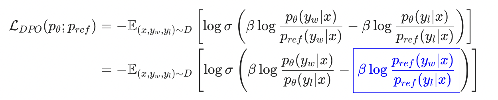

<div align="center">
      <h1>OpenDPO</h1>
</div>
<div align="center">
    <p align="center">
          <em> Open-source / Lightweight / Easy-to-use / Large-Scale / Extra-Long-Text </em>
    </p>
</div>

<hr>

DPO的损失函数可以做如下恒等变换，可以发现蓝色框中的结果是一个可以预计算的常数。因此，在使用DPO进行优化时，我们完全可以离线计算常数部分，在线只需要加载$p_\theta$进行训练，这样和sft的训练相差无几。



根据此思路，我们可以在[OpenSFT](https://github.com/mlpod/OpenSFT/tree/main)上进行二次开发。 涉及到的点主要是ref_model的离线log_prob的推理和在线损失的计算。

ref_model的离线log_prob的推理部分可以参考data/raw/infer.py，里面包含两种方式：
1. 给定<x>，输出y和y的概率；
2. 给定<x,y>，输出y的概率；

同模型同y下，两种方法存在精度差异，影响不大。

### 环境安装

```bash
git clone https://github.com/mlpod/OpenDPO.git
cd OpenDPO/train
pip install -r requirements.txt
```

### 数据组织方式

详见https://github.com/mlpod/OpenSFT/tree/main

如何标注chosen、rejected？

有4种方式可以选：
1. 人工标注；
2. 规则；
3. reward model；
4. 业界top模型打GSB或给定参考答案进行打分；

数据处理代码放在了data目录中。data目录中的raw目录是存放未预处理的文件，数据格式如下：
```json
{
    "context": [
        {
            "content": "你有什么宠物吗？",
            "role": "user"
        }
    ],
    "chosen": {
        "content": "<think>\n好的，用户问我有没有宠物。我需要先理解这个问题的意图。用户可能只是好奇，或者想找个话题聊天，也可能自己有宠物想分享经验。首先，我要明确作为AI，我没有真实的宠物，但可以生成相关的内容。\n\n接下来，我应该礼貌地回答我没有宠物，但可以讨论宠物相关的话题。用户可能想聊聊养宠物的经历、建议，或者有趣的宠物故事。需要确保回答友好，并且提供帮助的可能性。\n\n然后，考虑用户可能的深层需求。比如，他们可能在考虑养宠物，需要建议；或者想找人分享他们的宠物照片或故事。这时候我应该邀请他们提出具体的问题或话题，以便更好地协助。\n\n还要注意语气要亲切，避免机械感。使用表情符号增加亲和力，但不要过多。最后检查回答是否准确，确保没有错误信息，同时保持自然流畅。\n</think>\n我没有宠物哦，但我很乐意和你聊聊关于宠物的话题！无论是养猫、养狗还是其他小动物的经验，还是你想分享的有趣故事，我都可以帮你提供一些建议或信息~ 🐾",
        "role": "assistant"
    },
    "rejected": {
        "content": "<think>\n您好！我是由中国的深度求索（DeepSeek）公司开发的智能助手DeepSeek-R1。有关模型和产品的详细内容请参考官方文档。\n</think>\n您好！我是由中国的深度求索（DeepSeek）公司开发的智能助手DeepSeek-R1。有关模型和产品的详细内容请参考官方文档。",
        "role": "assistant"
    },
    "reference_chosen_log_prob": -115.16470484400884,
    "reference_rejected_log_prob": -1.512190420944506,
    "meta": {
        "category_id": 1,
        "category_name": "A"
    }
}
```

数据配比配置文件格式如下：
```json
{
    "data_name": "",
    "data_path": "",
    "ratio": [
        {
            "category_id": 1,
            "category_name": "",
            "size": 100,
            "sample_rate": 1.0
        },
        {
            "category_id": 2,
            "category_name": "",
            "size": 200,
            "sample_rate": 0.8
        }
    ]
}
```
用户需修改数据预处理逻辑代码 data/step1.preprocess.py，将数据处理成目标格式，并生成数据配比配置文件。
用户可按需修改配比。


详见数据处理脚本
```bash
sh data_process.sh
```

### 训练
```bash
sh train.sh
```
#### category-loss

```json
{
    "epoch": 2,
    "steps": 3,
    "lr": 1.22375e-05,
    "loss": 0.515095591545105,
    "coig/neo_loss": 0.5617072582244873,
    "stem_zh/phy_loss": 0.4811963737010956,
    "EduChat-Math_loss": 0.4951120913028717,
    "meta-math/GSM8K_zh_loss": 0.5640832781791687,
    "exam/coig_exam_loss": 0.6263442635536194,
    "gavinluo/applied_math_loss": 0.4919000566005707,
    "stem_zh/chem_loss": 0.4528641700744629,
    "stem_zh/bio_loss": 0.46091940999031067,
    "zhihu/zhihu_score9.0-10_clean_v10_loss": 0.5875096917152405,
    "xhs/xhs_loss": 0.7661288380622864,
    "stem_zh/med_loss": 0.42540857195854187,
    "human_value/100poison_loss": 0.5484293699264526,
    "ruozhiba/ruozhiba_ruozhiba_loss": 0.825197160243988,
    "logi_qa/logi-qa_loss": 0.6175104975700378,
    "Haijian/Advanced-Math_loss": 0.4288356602191925,
    "exam/kaoyan_loss": 0.6865882873535156
}
```
